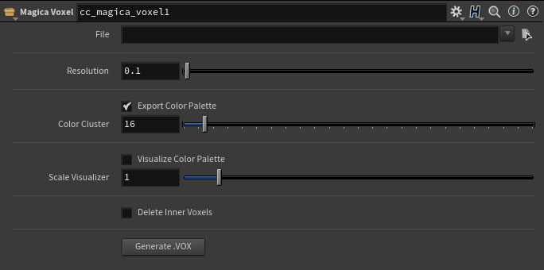
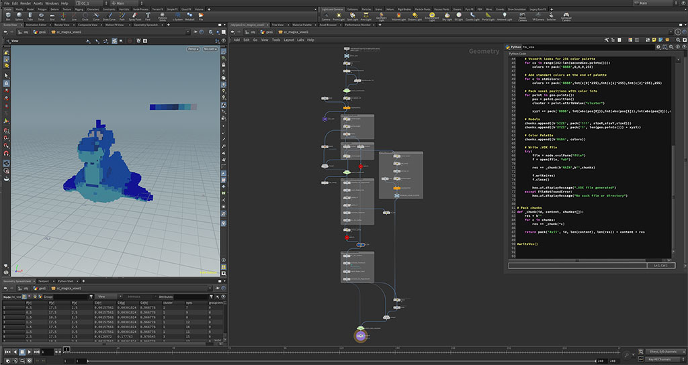
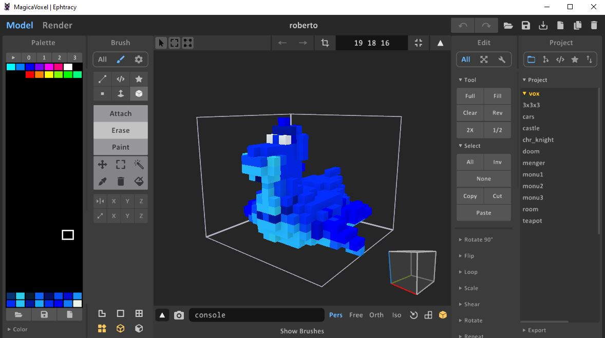
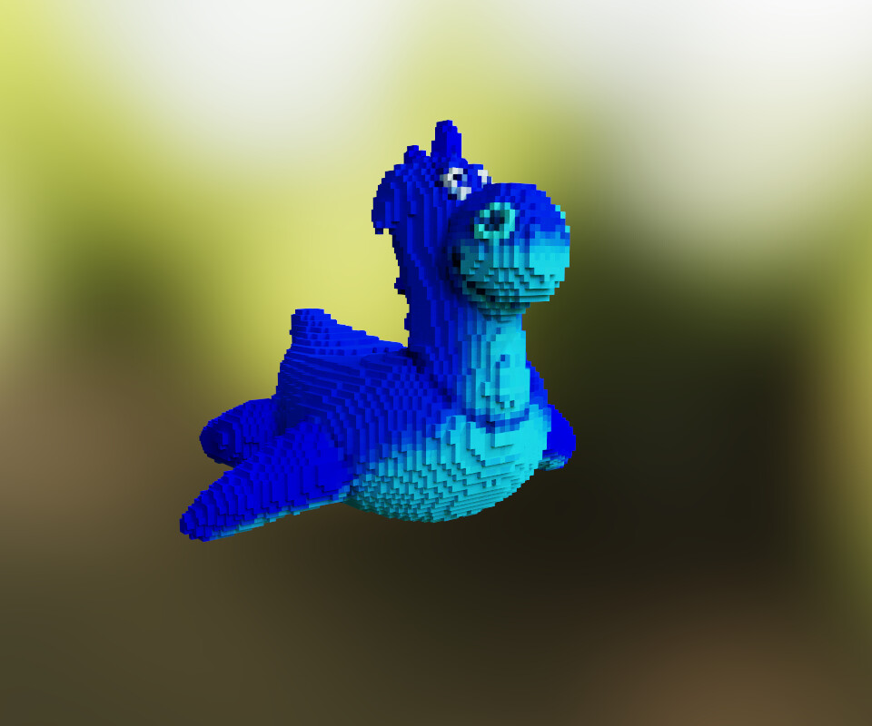

# Houdini to Magicavoxel
###### Houdini to MagicaVoxel Digital Asset.


###### Generates .VOX Magicavoxel (https://ephtracy.github.io/) file from given inputs. Uses Magicavoxel file format definitions (https://github.com/ephtracy/voxel-model)




###### Python code for writing .VOX format (Python SOP)
```python
from struct import pack

# Standard color palette
stdColors = [
[1,0,0],[1,0.5,0],[1,1,0],[0.5,1,0],[0,1,0],[0,1,0.5],[0,1,1],
[0,0.5,1],[0,0,1],[0.5,0,1],[1,0,1],[1,0,0.5],[1,1,1],[0,0,0]
]


# Gather data
def run(root_node):
    node = hou.node(root_node.path() + "/to_vox")
    geo = node.geometry()
    inputs = node.inputs()
    secondGeo = inputs[1].geometry()

    writeVox(node,geo,secondGeo)

    
# Generates .VOX Magicavoxel file from given inputs (https://ephtracy.github.io/)
# Uses Magicavoxel file format definitions (https://github.com/ephtracy/voxel-model)
def writeVox(node,geo, secondGeo):
    pMax = geo.attribValue('pMax')
    pMin = geo.attribValue('pMin')

    # Model size
    sizeX = int(abs(pMin[0]) + abs(pMax[0]))
    sizeY = int(abs(pMin[1]) + abs(pMax[1]))
    sizeZ = int(abs(pMin[2]) + abs(pMax[2]))
    
    res = pack('4si',b'VOX ',150)

    chunks = []

    xyzi = b''
    colors = b''
       
    # Generates color palette from second input (color cluster)
    for pnt in secondGeo.points():
        color = pnt.attribValue("Cd")
        colors += pack('BBBB',int(color[0]*255),int(color[1]*255),int(color[2]*255),255)
    
    # Fix for voxedit, complete color palette to 256 if its not
    # Voxedit looks for 256 color palette
    for cx in range(242-len(secondGeo.points())):
        colors += pack('BBBB',0,0,0,255)
        
    # Add standart colors at the end of palette
    for c in stdColors:
        colors += pack('BBBB',int(c[0]*255),int(c[1]*255),int(c[2]*255),255) 
    
    # Pack voxel positions with color info
    for point in geo.points():
        pos = point.position()
        cluster = point.attribValue("cluster")
           
        xyzi += pack('BBBB', int(abs(pos[0])),int(abs(pos[1])),int(abs(pos[2])),cluster+1)
     
    # Models
    chunks.append((b'SIZE', pack('iii', sizeX,sizeY,sizeZ)))
    chunks.append((b'XYZI', pack('i', len(geo.points())) + xyzi))
  
    # Color Palette
    chunks.append((b'RGBA', colors))
 
    # Write .VOX file
    try:
        file = node.evalParm("file")
        f = open(file, "wb")

        res += _chunk(b'MAIN',b'',chunks)

        f.write(res)
        f.close()
    
        hou.ui.displayMessage(".VOX file generated")
    except FileNotFoundError:
        hou.ui.displayMessage("No such file or directory")

        
# Pack chunks
def _chunk(id, content, chunks=[]):
    res = b''
    for c in chunks:
        res += _chunk(*c)
    
    return pack('4sii', id, len(content), len(res)) + content + res

    
#writeVox()
```

###### Some Render Results



